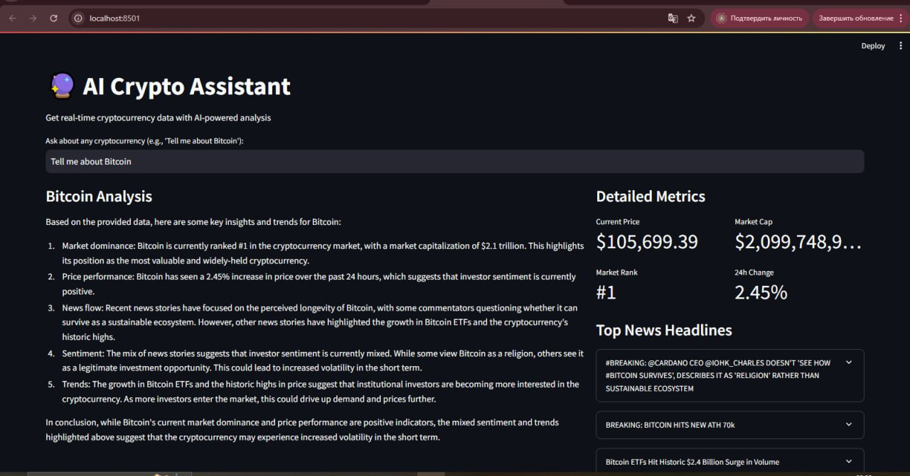

# 🔮 AI Crypto Assistant

A Streamlit-based web app that fetches live cryptocurrency data (price, market metrics, news) and generates an AI-powered summary using a local Ollama LLM model.

---

## 🚀 Features

- **Live Price** from Binance (USDT/BTC pairs)  
- **Market Metrics** (market cap, rank, 24h change) from CoinMarketCap  
- **Top News Headlines** from CryptoPanic  
- **AI Analysis**: concise 150–200-word summary via your local Ollama model (e.g. `llama2`)  
- **Flexible Query Parser**: understands full names (“Bitcoin”), tickers (“BTC”), and various question forms  
- **Graceful Error Handling**: fallback messages if data sources or AI server are unavailable  

---

## 📸 Demo



---

## 🛠️ Installation

1. **Clone the repository**  
   ```bash
   git clone https://github.com/aigerim1q/ai-crypto-assistant.git
   cd ai-crypto-assistant
   
## Create & activate a virtual environment
   ```bash
   python -m venv .venv
   # Windows
   .venv\Scripts\activate
   # macOS/Linux
   source .venv/bin/activate

```
## Install dependencies
 ```bash
pip install -r requirements.txt
```

## Configure environment variables
Create a file named .env in the project root:
 ```bash
CRYPTO_PANIC_API_KEY=your_cryptopanic_api_token
COINMARKETCAP_API_KEY=your_coinmarketcap_api_key
OLLAMA_HOST=http://127.0.0.1:11435
OLLAMA_MODEL=llama2
```
## Install & start Ollama

Desktop: open the Ollama app (it auto-serves).

CLI:
 ```bash
ollama pull llama2
ollama serve
```

Verify:

```bash
curl http://127.0.0.1:11435/v1/models
# Should return a JSON list with "llama2:latest"
```

## ▶️ Running the App
```bash
python -m streamlit run app.py
```

**Open your browser at http://localhost:8501 and enter queries like:

Tell me about Bitcoin

What’s the latest news on Ethereum?

SOL price and market cap

## 📂 Project Structure

├── .env                      
├── .gitignore

├── assets/

│   └── demo.png               
├── app.py                    
├── requirements.txt          
└── README.md                 

## 📝 Usage Examples
Query	                          What You’ll Get
Tell me about Bitcoin	          AI-generated summary + price, cap, rank, 24h change & headlines
What’s the latest news on ADA?	Polished AI summary focused on Cardano’s recent news & sentiment
SOL price                      	Current Solana price (Binance) + AI remark on recent performance
ETH market cap and rank       	CoinMarketCap data + context via AI

## 🔧 Troubleshooting
No news headlines?
CryptoPanic may have no recent articles for that coin. You’ll see “No recent headlines…” instead of an error.

“Cannot connect to Ollama” error

Ensure your ollama daemon is running on the port in your .env.

Verify with curl http://127.0.0.1:11435/v1/models.

Check Windows firewall / antivirus isn’t blocking localhost.

Price not showing
Add the coin’s ticker to TICKER_OVERRIDES in app.py (e.g. "yourcoin": "YRC").


## 📜 License
Feel free to tweak paths, URLs, or examples to match your own repo and environment!

